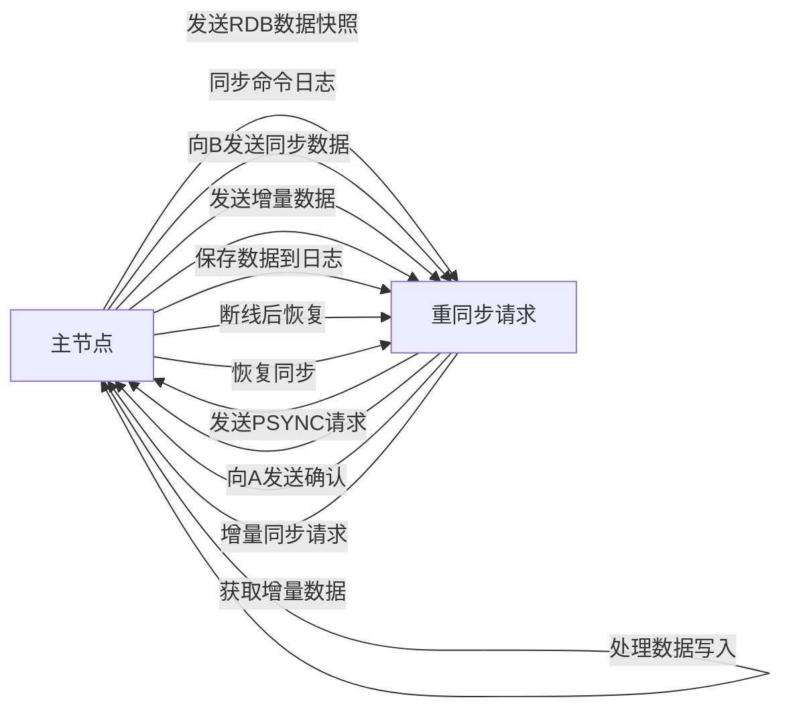
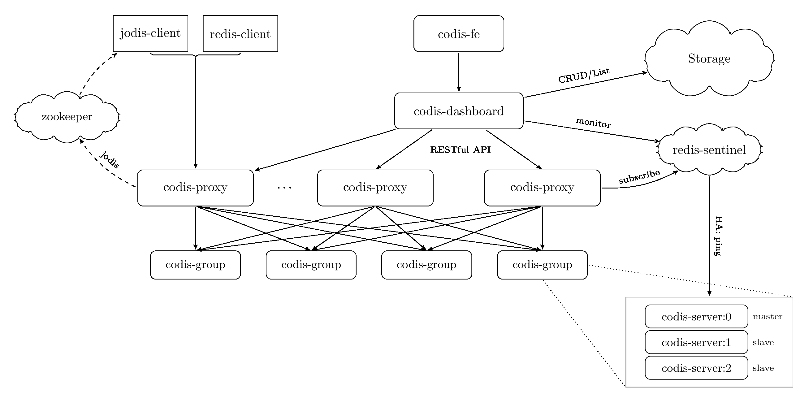

# Redis集群
对于数据存储领域，当数据量或者请求流量大到一定程度后，就必然会引入分布式，无论其是内存缓存还是持久化存储。

Redis提供了三种集群模式，分别是主从模式、哨兵模式、集群模式。

## 主从模式
Redis的主从模式，允许 Redis 将数据从一个主节点（Master）复制到一个或多个从节点（Slave）。主节点负责处理所有的写操作，而从节点复制主节点的数据，并响应读操作。

主从模式的数据同步过程：



全量同步：
+ 新从节点连接主节点 → 主节点生成 RDB 文件 → 从节点接收并加载 RDB 文件 → 完成全量同步。

增量同步：
+ 主节点执行写操作 → 生成命令日志 → 从节点接收并执行这些写操作 → 数据同步完成。

**复制超时可能导致的问题**
复制超时（Replication Timeout）是指从节点在一定时间内没有接收到主节点的同步数据或命令，导致复制过程中的连接中断或超时。

复制超时可能导致数据不一致(从节点数据同步更新落后)，触发全量同步(落后的偏移量超过阈值)进而加大主节点负载。

**主从模式存在的缺点**
1. 数据延迟：主从之间的数据同步必然存在一个延迟。从节点也提供读能力，会导致数据不一致。
2. 故障切换：没有自动切换主从的机制。在主节点出现问题宕机后，需要修改redis配置，指定新的主节点。

## Sentinel模式
哨兵模式相对于主从模式，主要是为Redis提供了故障自动转移的功能。

`Redis Sentinel`系统由多个`Sentinel`进程组成，通常至少运行三个`Sentinel`进程来进行故障检测和选举。哨兵节点是特殊的Redis节点，不会用于存储数据。

> 主观下线：一个哨兵节点自认为另一个节点下线，所以叫主观下线。
> 
> 客观下线：某个哨兵认为一个节点主观下线后，会询问其他哨兵这个节点是否下线，当超过一定数量（quorum配置，判断主节点客观下线的哨兵数量阈值）的哨兵都认为主观下线，就标记该节点为客观下线。

1. 每个`Sentinel`进程定期对**主节点**和**从节点**进行健康检查，通过 PING 命令向 Redis 实例发送请求。

2. 当哨兵发现一个主节点主观下线后，会询问其他哨兵主节点是否下线，达到阈值的哨兵认为主节点下线后，会标记主节点为客观下线。

3. 当主节点客观下线后，哨兵会启动**故障转移**机制，开始**故障转移选举**。一般就是先到先得，获得过半票数的节点成为新的主节点(避免脑裂)。

**存在的问题**

哨兵模式本质上还是主从模式，无法做水平扩展。

## Cluster集群
`Redis Cluster`通过分片（sharding）模式来对数据进行管理，使集群具备了水平扩展的能力。并支持分片间数据复制、故障转移和流量调度。

Redis Cluster将数据分配到不同的节点，并实现负载均衡和故障转移。

**哈希槽**：Redis Cluster 将所有的键（key）映射到 16384 个哈希槽（哈希槽数目是固定的，无法调整）。每个键通过计算其哈希值（CRC16）来确定所属的哈希槽。
```ini
slot = CRC16(key) % 16384
```

#### 为什么使用哈希槽而不是一致性hash。
一致性哈希的某个节点宕机或者掉线后，当该机器上原本缓存的数据被请求时，会从数据源重新获取数据，并将数据添加到失效机器后面的机器，这个过程被称为 "缓存抖动" ，而使用哈希槽的节点宕机，会导致一定范围内的槽不可用，只能通过主从复制加哨兵模式保证高可用。

个人理解：一来，一致性hash复杂度较高，固定hash槽实现简单。二来，redis cluster其实很少增加或减少节点，特别当节点数量发生剧烈变化时，会导致大规模数据迁移，一致性hash其实是不可控的，而固定hash槽则要可控的多。

#### Cluster的节点通信：Gossip 算法
Redis Cluster的集群节点间使用 Gossip(闲话、流言)协议进行通信。Gossip可以看成是符合BASE理论的保证最终一致性协议。

集群中的节点，每隔一段时间就会“随机”选择某些其他节点，进行信息交换。经过一段时间的通信，每个节点的状态会达到一致。该协议优点有负载低、去中心化、容错率高。

缺点：通信影响带宽；信息收敛速度较慢，

#### Cluster的故障转移
1. 故障确认：每个节点通过 Gossip 协议与其他节点进行周期性的消息交换，如果没有收到来自某个节点的消息，会将其标记为疑似下线(Probable Fail，Pfail)
2. 疑似下线：节点会通过 Gossip 协议，向其他节点发送消息，询问该节点是否也疑似下线(PFAIL)
3. 下线：如果大多数节点都确认了该主节点的疑似下线状态(PFAIL)，那么该主节点会被标记为下线(FAIL)
4. 故障转移：集群会从该主节点的从节点中选举一个节点，并将其提升为新的主节点。
    + 当从节点发现自己复制的主节点状态为已下线时，从节点就会向集群广播一条请求消息，请求所有收到这条消息并且具有投票权的主节点给自己投票。
    + 选举新主节点的算法是基于 Raft 算法的 Leader Election 方法来实现的
5. 新主节点上线：新的主节点会向集群中广播一条 Pong 消息，将自己升主的信息通知到集群中所有节点。并开始处理自己所负责 Slot 对应的请求。


## Proxy模式-以Codis为例
通过一个代理对象管理 Redis 实例之间的数据路由和请求转发。代理节点接受客户端请求，根据请求的键进行哈希计算，确定应该将请求转发到哪个 Redis 节点（主节点或从节点）。

Codis的架构：


> 因为 codis-proxy 是无状态的，可以比较容易的搭多个实例，达到高可用性和横向扩展。


